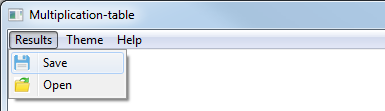

# Multiplication_table

## Introduction

**NMultiply** is a test program for checking knowledge of multiplication table with graphical user interface. 
Written on *C* with *WinApi framework*. After test you can see your results and correct answers number in percents.
Here is an overview of NMultiply GUI:


---

## Installation
- #### Step 1
First of all you need to clone this repository. The following command:

    git clone https://github.com/Nikita-bunikido/Multiplication_table.git

- #### Step 2
Than you need to find  ```main.exe```  file and run it.

- #### Step 3

If you don't know how to use program, please read the tutorial:

---

## Usage
This is a short tutorial for understanding how to work with program. 
- ### Graphic elements
  - #### Buttons
    Here are two buttons:
    NEXT | FINISH
    :---:|:-----:
    Go to next exercise | Finish the test
    
    When you press **Next** button program generates new exercise. And when you press **Finish** button you finish your test, and program shows your results.

  - #### Input field
    There is an input field in the right side of window. It is going after generated exercise. You need to click on it and start writing your answer.

    

    *You can write only numbers 0-9 in input field*
    If you finish writing your answer, press the **Next** button if you want to continue.
  - #### Information field
    There is also information field on the bottom of input field. 

    

    When you press **Next** button you get result. If your answer was correct, you will get message "**Correct answer**" else you will get message "**Incorrect answer**".
  - #### Output field
    In output field you get an exercise to solve.

    

    It generates every time when you press **Next** button.

- ### Top menu
    In the top of window you have a menu:

    

  - #### Results tab
    In this tab you have 2 puncts. **Save** and **Open**.

    

    When you finish your test, you can save your results by clicking **Save**. After saving you can open the *results.txt* file by clicking **Open** tab.
    Also you can open *results.txt* file without program. It is in *RES* folder.

  - #### Theme tab
    In this tab you also have 2 puncts. **Light** and **Dark**.

    

    You can just switch the theme in this tab. If you like dark colors, you can click the **dark**. And of course if you don't like it choose light theme by clicking **light** punct.

    **How dark theme looks:**

    

  - ### Help tab
    After you clicking the **Help** tab you will receive a link to this page.

    ---

    ### Compatibility
    NMultiply works on **Windows 7** and higher OS.
    *64 bit .exe* file in repository.

    ---
    
     

     **Enjoy!**
